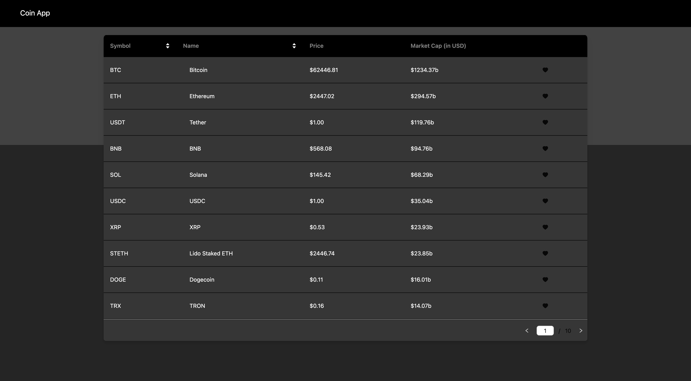

# Coin App

A frontend application that displays a list of cryptocurrencies and their realtime prices in USD. It also shows details of particular currencies such as the trend in their prices since last month. The application is cross-platform friendly.



## Table of Contents

1. [Introduction](#introduction)
2. [Features](#features)
3. [Installation](#installation)
4. [Running the App](#running-the-app)
5. [Notes](#notes)

## Introduction

This project is a web application that utilizes React and typescript on the frontend.

## Features

- React for dynamic, interactive UI
- TypeScript support for type safety
- Tailwind CSS for styling
- Antd as component library
- React Query for fetching and caching data and error handling
- Recoil for global state management
- Notistack for notifying users of side effects
- Web Sockets for subscribing to real time data updates

## Installation

1. **Clone the repository:**

   ```bash
   git clone https://github.com/YashasaveeKesarwani99/coin-app.git
   cd coin-app
   ```

2. **Install dependencies:**

   ```bash
   cd coin-app
   npm install
   ```

## Usage

1. **Navigate to the `root` directory:**

   ```bash
   cd coin-app
   ```

2. **Start the React development server:**

   ```bash
   npm run dev
   ```

   This will run the React app on `http://localhost:5173`.

## Notes

- **Design Layout** - I saw how the original website was handling the rendering of data and found it convienient and proggresive to implement it for this app.

- **The implementation** - I've used react and typescript to form the basis of the project. Vite as the modular bundler.

- The data fetching, error throwing, caching and loading/pending status has been taken care by `react query`. The custom hook that I've made to fetch data acts as controller. the model/schema of response have been exported to `global.d.ts`. The view structure has been implemented through modular and clean code practices. I have divided the codebase into pages, the subsequent components.

- The data fetching is done with a `custom hook` which caching and an appropriate stale time to make efficient calls to our server. I have also created two other custom hooks for showing snackbar ( error handling in frontend ) and for manipulating the local storage data.

- I have used `antd` as it has lot of options, good documentation and also the bundle size is industry standards giving a good score to this application in `lighthouse`

- I have used `tailwindCSS` as the css library. My goto library as it has the best documentation, suggestive classes and again - lot of options.

- I have implemented global state management through `Recoil` and haven't used `Redux` because there was only one state (page number) that had to be managed globally and redux implementing redux for this would have been a task itself.

- I have implemented unit testing with `vitest` and `react-testing-library`. Vitest is similar to jest, it performs well with vite which is the reason I prefer vitest when using vite.

- There would be many drawbacks in the application as it needs a thorough testing but I'm happy to say that it works right now. it's responsive too. I'm open to feedbacks!

## Additional Notes

- The first thing that I would change in this project is the layout, I think it was not deeply though of. A more flexible layout would be better instead of contraining contents with `absolute` positioning.

- The application has good web vitals, the FCP is within good limit. Same is with CLS score. Although `preconnect` -ing of the origin `https://api.coincap.io` would have reduced FCP and LCP.

- Next, I think using `react-helmet` will increase the SEO score of the application by adding meta descripition for all the pages.

- There was also an intent to add `lazy loading` but the app comes into the folder and so there would have been no significant decrease in the initial load time.

- A good addition to this app can be implementing `service worker` to the app so that it can be played with when offline and there would be less api hits on the whole to fetch data.
